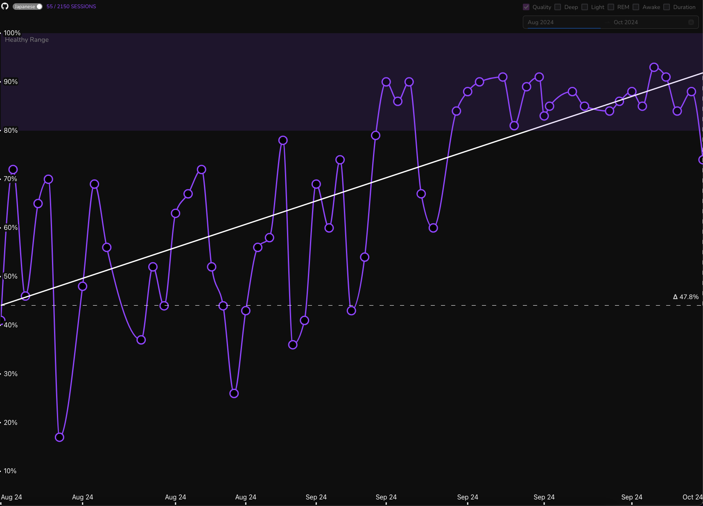
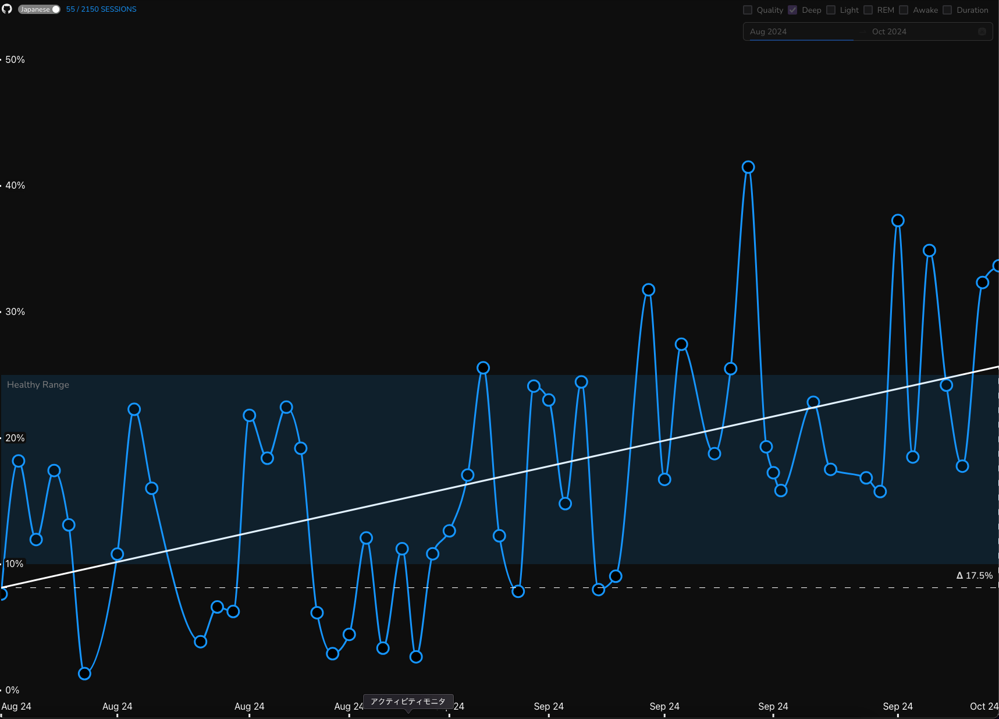
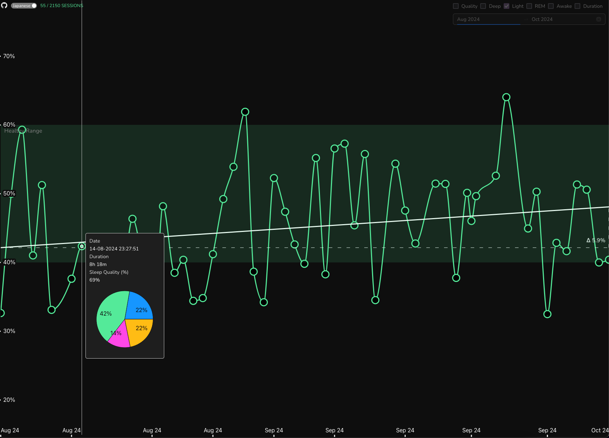
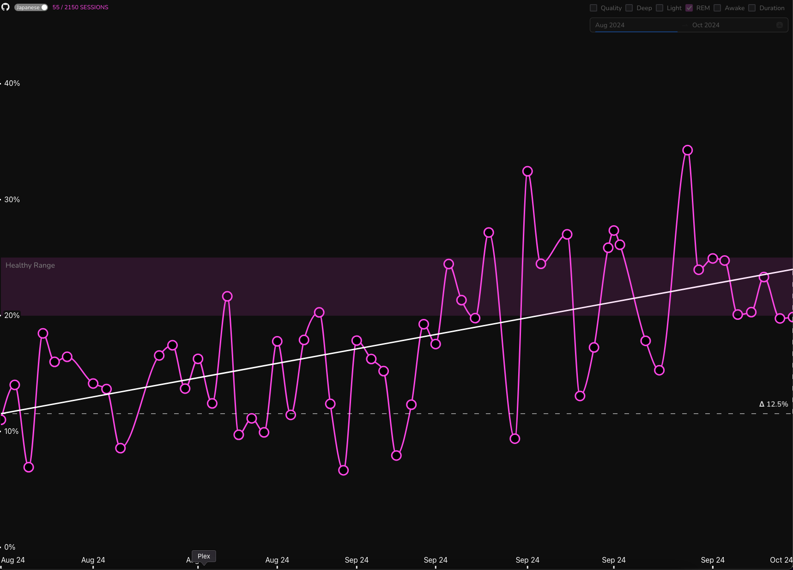
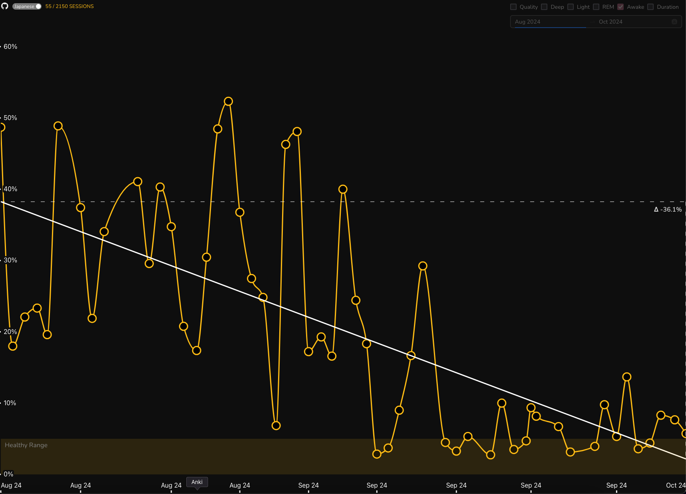
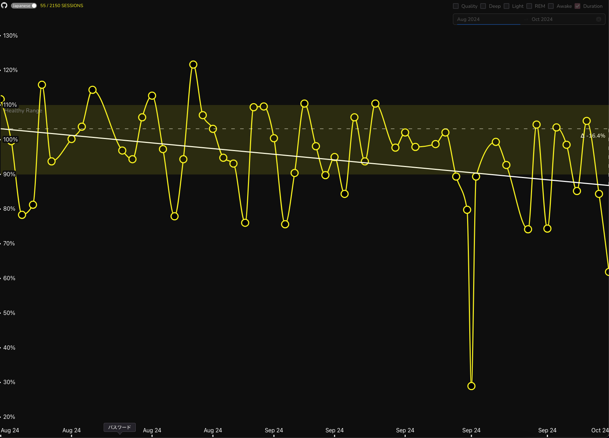

# :zzz: Sleep Health Data Visualisation

A simple 2D line chart visualisation of my sleep data as recorded by my Apple Watch using [Pillow](https://pillow.app/) for iOS.

# Sleep Quality (%)

# Deep Sleep (% of session duration)

# Light Sleep (% of session duration)

# REM Sleep (% of session duration)

# Awake Time (% of session duration)

# Session Duration (% of 8 hours)

# To Do

- Select multiple sleep metric at once
- A split view that renders stacked charts to compare two metric with a brush
  - Remove duplicate improvements made label?
  - Add brush in the middle
- Split SleepContext into two. Isolate configuration into its own context