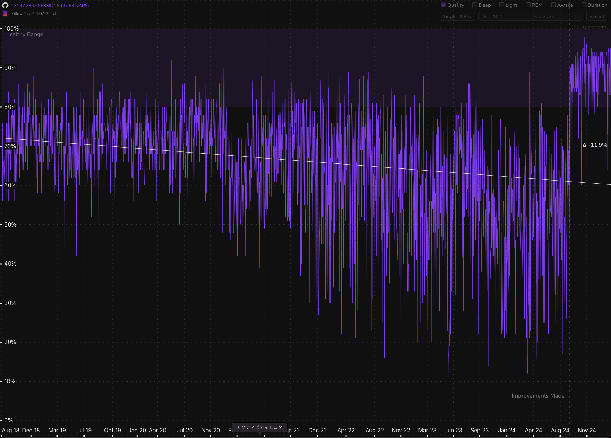
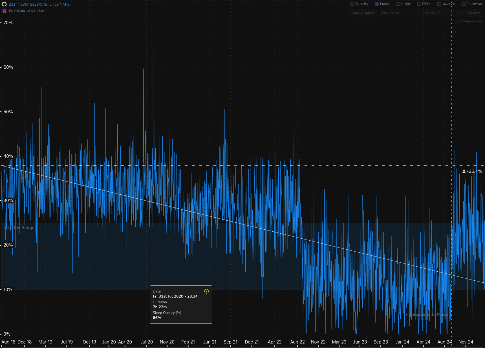
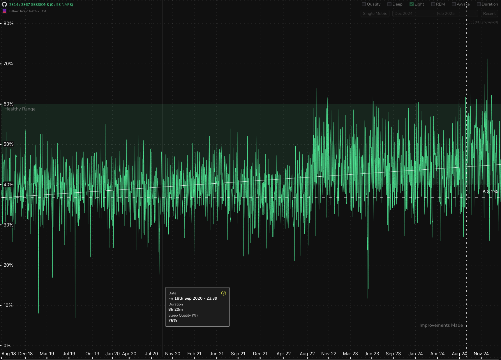
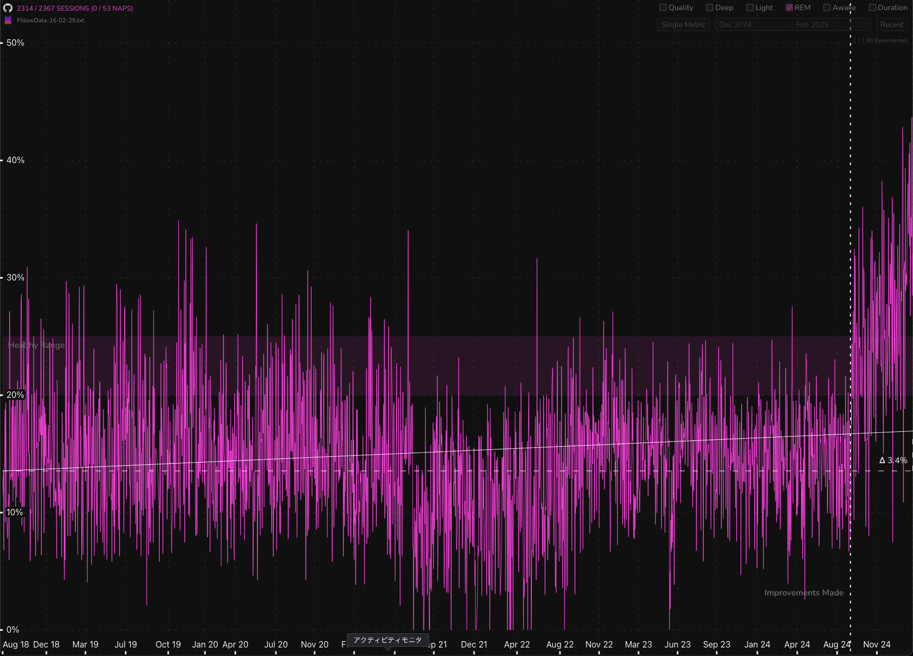
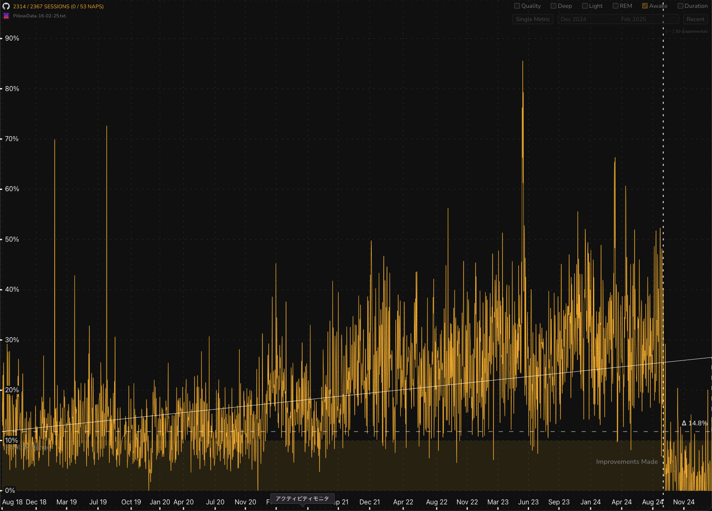
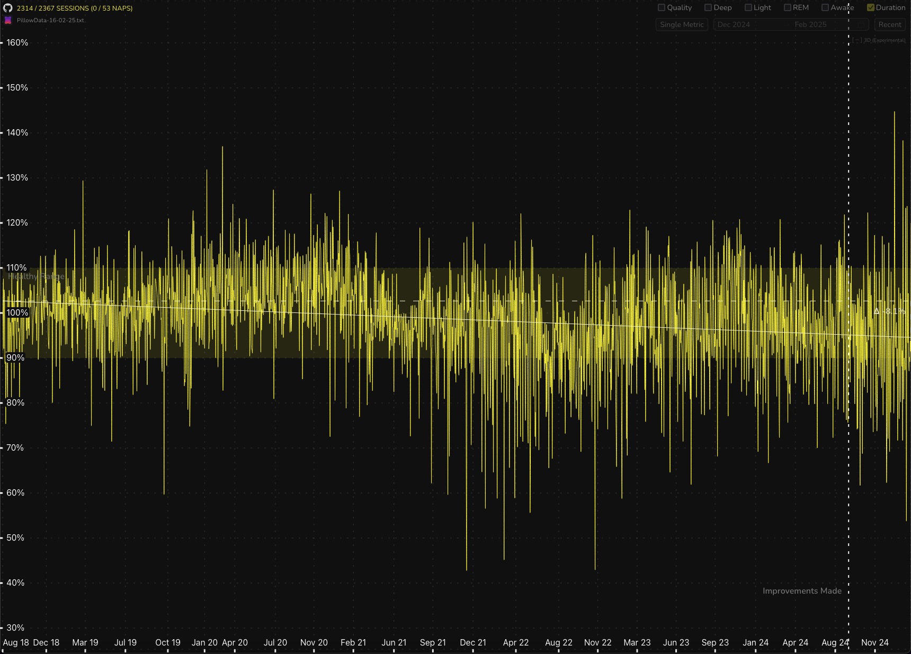

# :zzz: Sleep Health Data Visualisation

A simple 2D line chart visualisation of my sleep data as recorded by my Apple Watch using [Pillow](https://pillow.app/) for iOS.

<!-- TOC -->
* [Examples](#examples)
* [Metrics](#metrics)
* [To Do](#to-do)
<!-- TOC -->

# Examples
- [Recent sleep quality vs awake time stacked charts](https://tomplum.github.io/sleep?metric=quality&start=1720652400000&end=1731283200000&lng=en&stacked=true&metrics=quality%2Cawake_time)
- [Sleep quality over time across all recorded sessions](https://tomplum.github.io/sleep?metric=quality&start=1534457817000&end=1728199961000&lng=en&stacked=false&metrics=quality%2Cdeep_sleep)

# Metrics

## Sleep Quality (%)

## Deep Sleep (% of session duration)

## Light Sleep (% of session duration)

## REM Sleep (% of session duration)

## Awake Time (% of session duration)

## Session Duration (% of 8 hours)

# To Do

- Select multiple sleep metric at once
- Split SleepContext into two. Isolate configuration into its own context
- Date parsing not working in Safari and breaks graph
- Update screenshots in README
- Update session breakdown to include data like the ios app does
- Can we get heart rate data from the raw database export?
- There are 58k sleep stage records mapped -> undefined, why?
- If you change the date-range and the selected session is no longer in that range, what should happen?
- Breakdown pie chart hover, see time in each stage in tooltip