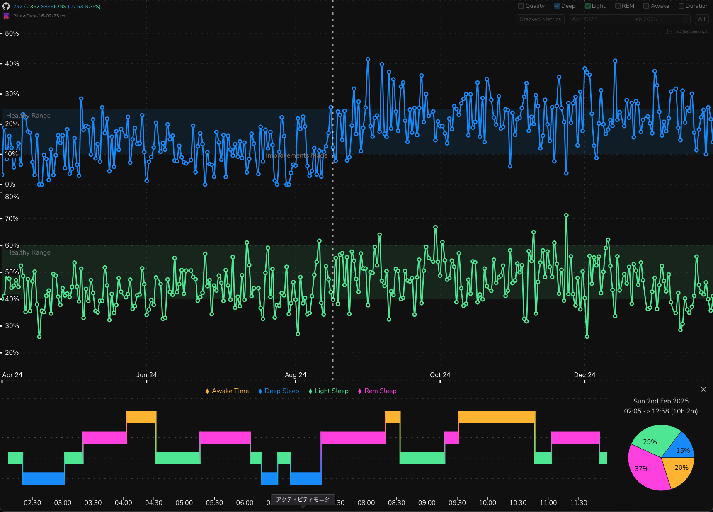
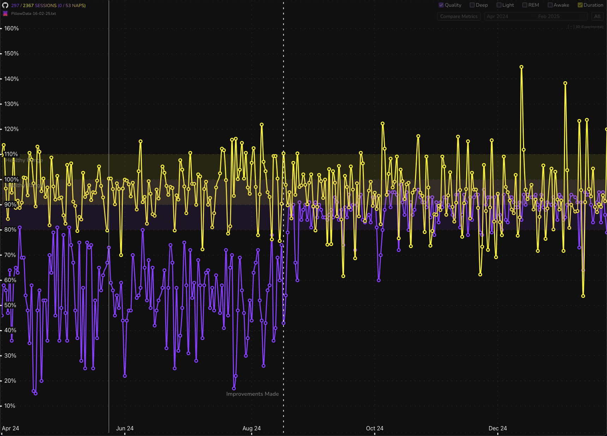
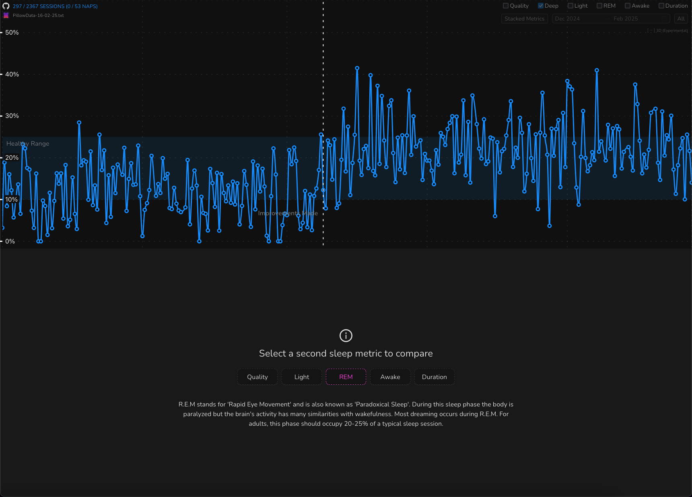
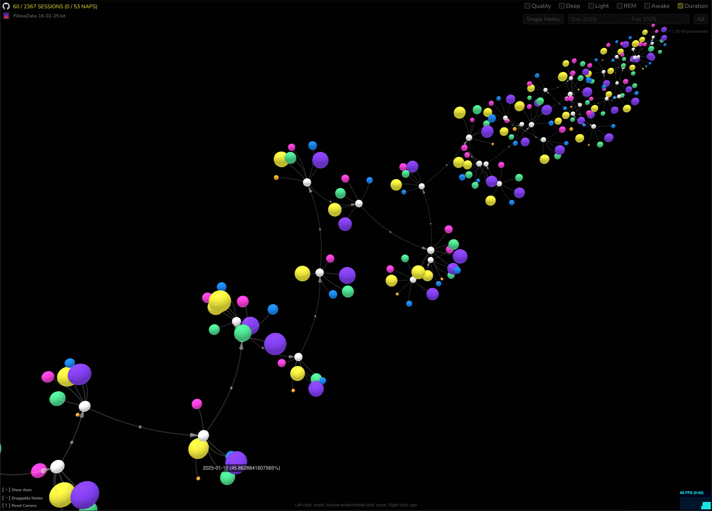

# :zzz: Sleep Health Data Visualisation

A simple 2D line chart visualisation of my sleep data as recorded by my Apple Watch using [Pillow](https://pillow.app/) for iOS.

<!-- TOC -->
* [:zzz: Sleep Health Data Visualisation](#zzz-sleep-health-data-visualisation)
* [Examples](#examples)
* [2D Graph Views](#2d-graph-views)
  * [Stacked Metrics](#stacked-metrics)
  * [Compare Metrics](#compare-metrics)
  * [Single Metrics](#single-metrics)
    * [Sleep Quality (%)](#sleep-quality-)
    * [Deep Sleep (% of session duration)](#deep-sleep--of-session-duration)
    * [Light Sleep (% of session duration)](#light-sleep--of-session-duration)
    * [REM Sleep (% of session duration)](#rem-sleep--of-session-duration)
    * [Awake Time (% of session duration)](#awake-time--of-session-duration)
    * [Session Duration (% of 8 hours)](#session-duration--of-8-hours)
* [3D Experimental View](#3d-experimental-view)
* [To Do](#to-do)
<!-- TOC -->

# Examples
- [Recent sleep quality vs awake time stacked charts](https://tomplum.github.io/sleep?metric=quality&start=1720652400000&end=1731283200000&lng=en&stacked=true&metrics=quality%2Cawake_time)
- [Sleep quality over time across all recorded sessions](https://tomplum.github.io/sleep?metric=quality&start=1534457817000&end=1728199961000&lng=en&stacked=false&metrics=quality%2Cdeep_sleep)

# 2D Graph Views
2-Dimensional line charts to visual the change in specific sleep metrics over time. Clicking a sleep session node will render a gantt-style chart at the bottom with a breakdown of the sleep stages.

## Stacked Metrics
Renders two charts stacked on top of one another so that the axes are separate. Useful for comparing two different metrics without the lines overlapping and creating noise.

## Compare Metrics
Renders a single chart with two lines for each of the selected metrics.

## Single Metrics
Renders a single line chart for the selected metric.

### Sleep Quality (%)

### Deep Sleep (% of session duration)

### Light Sleep (% of session duration)

### REM Sleep (% of session duration)

### Awake Time (% of session duration)

### Session Duration (% of 8 hours)

# 3D Experimental View

# To Do

- Date parsing not working in Safari and breaks graph
- Update screenshots in README
- Update session breakdown to include data like the ios app does
- Can we get heart rate data from the raw database export?
- There are 58k sleep stage records mapped -> undefined, why?
- If you change the date-range and the selected session is no longer in that range, what should happen?
- Web worker makes about 800 cached resource requests while its loading
- Looks like the line chart redraws from new each time now instead of tweening. Is it the <Line /> loop?
- Move sleep colours to a common stylesheet